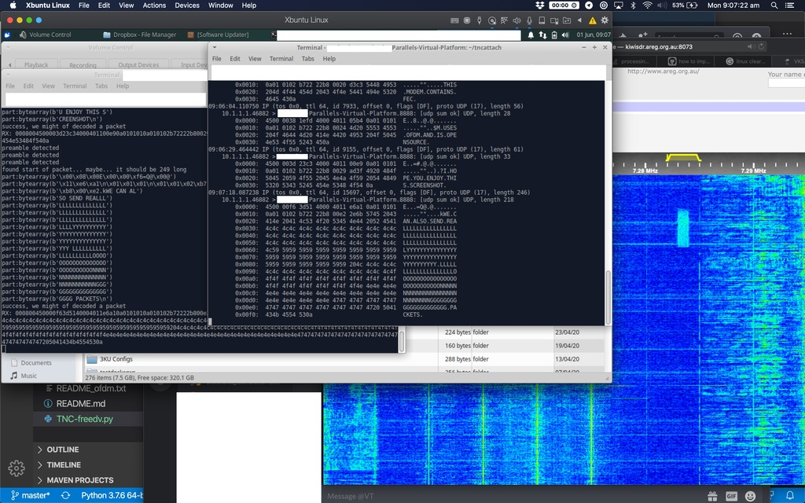

FreeDV-TNC
==

This code interfaces FreeDV 700D modem with a virtual KISS serial port that can be used with tools like APRS, kissattach and tncattach. This was an experiment to try to make an existing opensource modem KISS compatiable that had better performance than the typical Bell 103 300 baud modem.

This was also an experiment to see if FreeDV could be interfaced with using Python



Code Quality Warning
--

This code was developed in under 24 hours as a proof of concept. The code in the repo does not represent my professional coding style. This repo serves as an example of what we can do with the FreeDV data modems.

Limited testing has been performed.

Credits
--
David Rowe and the FreeDV team for developing the modem and libraries 

Warnings
--
FreeDV library is expecting a sample rate of 8000 however most radios and soundcards won't support this. In my testing I was using pulseaudio and it has a built in sample rate conversion. On my debian machine I was also able to use `samplerate` as the audio device - your milage may vary.

As we use PTS/PTY for serial emulation for better support with software this software will only run on Linux at the moment. In theory it can be adapted to run on macos or Windows using a TCP server instead.

Testing needs to be done on long runs of 0x00's - maybe scrambling is required?

The freedv modem currently seems to require a long amount of time to gain sync. To combat this a large amount of preamble is added - this means that this configuration will prefer longer frames rather than lots of short ones.

I've added a small amount of basic flow control (max packets to send before requiring waiting for a little bit). I'm not sure if it's meant to be the TNCs job to do this flow control considering higher layers also do it - though most assume you can do full duplex.


Configuration
--

An ICOM IC-7100 was used for testing but other rigs that support SSB should work fine.

### Install dependencies
```
sudo apt-get install portaudio19-dev
pip3 install pyaudio kissfix kiss # TODO kissfix shouldn't depend on kiss but does.
```

### Install Codec2
```
git clone https://github.com/drowe67/codec2.git
cd codec2
mkdir build_linux
cd build_linux
cmake ../
make
```

Update `libname` in `TNC-freedc.py` to point towards your `build_linux/src/libcodec2.so` - also update the sound device configuration.


### Installing rigctld
Rigctl is used to key the radio when transmitting.
```
apt-get install libhamlib-utils libhamlib-dev
```

### Installing tncattach (optional)
tncattach is used here as a test, however you can use any KISS software with this modem.
more here: https://unsigned.io/ethernet-and-ip-over-packet-radio-tncs/
```
git clone https://github.com/markqvist/tncattach.gitA
cd tncattach
make
make install
```

### Starting the TNC
```
rigctld -m 370 -r /dev/ttyUSB0 & # Start rigctld and background. If your RX only you can use -m 1 for the dummy interface
python3 TNC-freedv.py &
```

The program should then say `Our PTY is /dev/pts/22`. This is the serial port you can use in your applications as a TNC

For example with tncattach:
```
sudo tncattach /dev/pts/22 115200 --mtu 1400 -v
```
